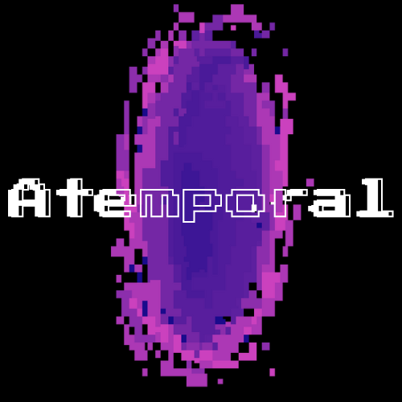

<<<<<<< HEAD
<h1 align="center">
  
  
Learn from the past, do it in the present, and change the future.</h3>
</h1>

 

<h1 style="color:#00BCD4">Game Project: <strong>Atemporal</strong></h1>
  

  
<strong>Language:</strong> Java 21 
  <strong>Framework:</strong> JavaFX 
  <strong>Agile Framework:</strong> Scrum

 

## 🧭 Presentation

<strong style="color:#00BCD4;">Atemporal</strong> is a 2D Beat 'em up style game inspired by Soul Knight and Streets of Rage. The goal of this project is to utilize the <strong style="color:#FF5722;">SCRUM</strong> methodology and deepen our knowledge of object-oriented programming (OOP).

## 📖 Prologue

Players can have immersive experiences through temporal rifts, exploring different historical periods of humanity. In the Middle Ages, help Sir Dante eliminate skeletal threats and end the reign of the dark lord Malakar. End a world war in the Contemporary Era as a special forces soldier, or perhaps, in the chaotic future of 2099, help B.M.O. to stop Cybernet and bring an end to this <strong>ATEMPORAL</strong> chaos.

## 🕹️ Gameplay

In game, similar to Streets of Rage, enemies will appear from the right side of the screen. Players can move and attack them using the unique abilities of each class. Each distinct map features its own set of enemies and a unique boss at the end of each level, providing a challenging and engaging experience.

## 💻 Technologies

## 🤝 Collaborators

The following people contributed to this project being carried out:

<table>
  <tr>
      <td align="center">
      <a href="https://github.com/KauanIzidoro" title="Github">
         
        
          <b>Kauan</b>
        
      </a>
    </td>
    <td align="center">
      <a href="https://github.com/gmgpx" title="Github">
         
        
          <b>Gustavo</b>
        
      </a>
    </td>
    <td align="center">
      <a href="https://github.com/05samuk" title="Github">
         
        
          <b>Samuel</b>
        
      </a>
    </td>
    <td align="center">
      <a href="https://github.com/JJuanPablo" title="Github">
         
        
          <b>Juan</b>
        
      </a>
    </td>
  </tr>
</table>
=======
<h1 style="color:#4CAF50;">Databasers Corporation</h1>

<h2 style="color:#2196F3;">Game Project: <strong>Atemporal</strong></h2>

<strong>Language:</strong> Java 21 
<strong>Framework:</strong> JavaFX 
<strong>Agile Framework:</strong> Scrum

<h3 style="color:#9C27B0;">Presentation</h3>

Our team—<strong style="color:#FFC107;">Kauan</strong>, <strong style="color:#FFC107;">Juan</strong>, <strong style="color:#FFC107;">Samuel</strong>, and <strong style="color:#FFC107;">Gustavo</strong>—proudly presents <strong style="color:#00BCD4;">Atemporal</strong>, a game inspired by <strong style="color:#00BCD4;">Soul Knight</strong>, <strong style="color:#00BCD4;">Streets of Rage</strong>, and <strong style="color:#00BCD4;">Stardew Valley</strong>. This project is our journey into mastering Object-Oriented Programming (OOP) using the <strong style="color:#FF5722;">SCRUM</strong> methodology.

<h3 style="color:#9C27B0;">Prologue</h3>

In <strong style="color:#00BCD4;">Atemporal</strong>, players traverse through the <strong style="color:#FFEB3B;">Middle Ages</strong>, the <strong style="color:#FFEB3B;">Contemporary Era</strong>, and the futuristic world of <strong style="color:#FFEB3B;">2099</strong>. Choose between a <strong style="color:#FFEB3B;">Medieval Knight</strong>, a <strong style="color:#FFEB3B;">Special Forces Soldier</strong>, or a <strong style="color:#FFEB3B;">robot</strong> fighting for survival.

<h3 style="color:#9C27B0;">Gameplay</h3>

<strong style="color:#00BCD4;">Atemporal</strong> is a 2D Beat 'em up game featuring unique character classes and epic battles with dynamic enemies.

>>>>>>> 3eb029d80cc556dbddbfbfe4e1d6a05809d7e37a
