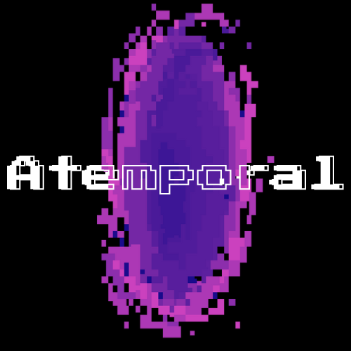

### Contents / Conteúdos

- [English](#english)
- [Português](#português)

 

>  English

 

<h1 align="center">
  
  
Learn from the past, do it in the present, and change the future.</h3>
</h1>

 

<h1 style="color:#00BCD4">Game Project: <strong>Atemporal</strong></h1>

  
<strong>Language:</strong> Java 21 
  <strong>Framework:</strong> JavaFX 
  <strong>Agile Framework:</strong> Scrum

 

## 🧭 Presentation

<strong style="color:#00BCD4;">Atemporal</strong> is a 2D Beat 'em up style game inspired by **Soul Knight** and **Streets of Rage**. The goal of this project is to utilize the <strong style="color:#FF5722;">SCRUM</strong> methodology and deepen our knowledge of object-oriented programming (OOP).

<table>
  <tr>
      <td align="center">
         
        
          <b>Soul Knight</b>
        
      </a>
    </td>
    <td align="center">
         
        
          <b>Streets of Rage 4</b>
        
      </a>
    </td>
  <tr>
<table>

## 📖 Prologue

Players can have immersive experiences through temporal rifts, exploring different historical periods of humanity. In the Middle Ages, help Sir Dante eliminate skeletal threats and end the reign of the dark lord Malakar. End a world war in the Contemporary Era as a special forces soldier, or perhaps, in the chaotic future of 2099, help B.M.O. to stop Cybernet and bring an end to this <strong style="color:#00BCD4;">ATEMPORAL</strong> chaos.

## 🕹️ Gameplay

In game, similar to **Streets of Rage**, enemies will appear from the right side of the screen. Players can move and attack them using the unique abilities of each class. Each distinct map features its own set of enemies and a unique boss at the end of each level, providing a challenging and engaging experience.

<table>
  <tr>
      <td align="center">
         
        
          <b>Teenage Mutant Ninja Turtles: Shredder's Revenge</b>
        
      </a>
    </td>
    <td align="center">
         
        
          <b>Streets of Rage 4</b>
        
      </a>
    </td>
  <tr>
<table>

## 💻 Technologies

## 💡 Concept

**[🎨 Figma Prototype](https://www.figma.com/design/NGgqwBoLR8VmkY2Npwnrld/Prot%C3%B3tipo?node-id=0-1&t=d9A0FylNrJmmIOvL-1)**

**[📌 Game Concept in Figma](https://www.figma.com/board/ySHEMOjnEVKOhBahRAtJEl/Projeto-Jogo-em-Java?node-id=0-1&t=pyLgSd3ro10QEjmo-1)**

## 🤝 Collaborators

The following people contributed to this project being carried out:

<table>
  <tr>
      <td align="center">
      <a href="https://github.com/KauanIzidoro" title="Github">
         
        
          <b>Kauan</b>
        
      </a>
    </td>
    <td align="center">
      <a href="https://github.com/gmgpx" title="Github">
         
        
          <b>Gustavo</b>
        
      </a>
    </td>
    <td align="center">
      <a href="https://github.com/05samuk" title="Github">
         
        
          <b>Samuel</b>
        
      </a>
    </td>
    <td align="center">
      <a href="https://github.com/JJuanPablo" title="Github">
         
        
          <b>Juan</b>
        
      </a>
    </td>
  </tr>
</table>

 

>  Português

 

<h1 align="center">
  
  
Aprenda com o passado, faça no presente e mude o futuro.</h3>
</h1>

 

<h1 style="color:#00BCD4">Projeto de Jogo: <strong>Atemporal</strong></h1>

  
<strong>Linguagem:</strong> Java 21 
  <strong>Framework:</strong> JavaFX 
  <strong>Metodologia Ágil:</strong> Scrum

 

## 🧭 Apresentação

<strong style="color:#00BCD4;">Atemporal</strong> é um jogo estilo Beat 'em up 2D inspirado em **Soul Knight** e **Streets of Rage**. O objetivo deste projeto é utilizar a metodologia<strong style="color:#FF5722;"> SCRUM</strong> e aprofundar nossos conhecimentos em programação orientada a objetos (POO).

<table>
  <tr>
      <td align="center">
         
        
          <b>Soul Knight</b>
        
    </td>
    <td align="center">
         
        
          <b>Streets of Rage 4</b>
        
    </td>
  </tr>
</table>

## 📖 Prólogo

Os jogadores podem ter experiências imersivas através de fendas temporais, explorando diferentes períodos históricos da humanidade. Na Idade Média, ajude Sir Dante a eliminar ameaças esqueléticas e acabar com o reinado do senhor das trevas, Malakar. Termine uma guerra mundial na Era Contemporânea como um soldado das forças especiais, ou talvez, no futuro caótico de 2099, ajude B.M.O. a parar a Cybernet e acabar com esse caos <strong style="color:#00BCD4;">ATEMPORAL</strong>.

## 🕹️ Jogabilidade

No jogo, semelhante a **Streets of Rage**, os inimigos aparecerão do lado direito da tela. Os jogadores podem se mover e atacá-los usando as habilidades únicas de cada classe. Cada mapa distinto apresenta seu próprio conjunto de inimigos e um chefe único no final de cada nível, proporcionando uma experiência desafiadora e envolvente.

<table>
  <tr>
      <td align="center">
         
        
          <b>Teenage Mutant Ninja Turtles: Shredder's Revenge</b>
        
    </td>
    <td align="center">
         
        
          <b>Streets of Rage 4</b>
        
    </td>
  </tr>
</table>

## 💻 Tecnologias

## 💡 Conceito

**[🎨 Protótipo no Figma](https://www.figma.com/design/NGgqwBoLR8VmkY2Npwnrld/Prot%C3%B3tipo?node-id=0-1&t=d9A0FylNrJmmIOvL-1)**

**[📌 Conceito do Jogo no Figma](https://www.figma.com/board/ySHEMOjnEVKOhBahRAtJEl/Projeto-Jogo-em-Java?node-id=0-1&t=pyLgSd3ro10QEjmo-1)**

## 🤝 Colaboradores

As seguintes pessoas contribuíram para a realização deste projeto:

<table>
  <tr>
      <td align="center">
      <a href="https://github.com/KauanIzidoro" title="Github">
         
        
          <b>Kauan</b>
        
      </a>
    </td>
    <td align="center">
      <a href="https://github.com/gmgpx" title="Github">
         
        
          <b>Gustavo</b>
        
      </a>
    </td>
    <td align="center">
      <a href="https://github.com/05samuk" title="Github">
         
        
          <b>Samuel</b>
        
      </a>
    </td>
    <td align="center">
      <a href="https://github.com/JJuanPablo" title="Github">
         
        
          <b>Juan</b>
        
      </a>
    </td>
  </tr>
</table>

